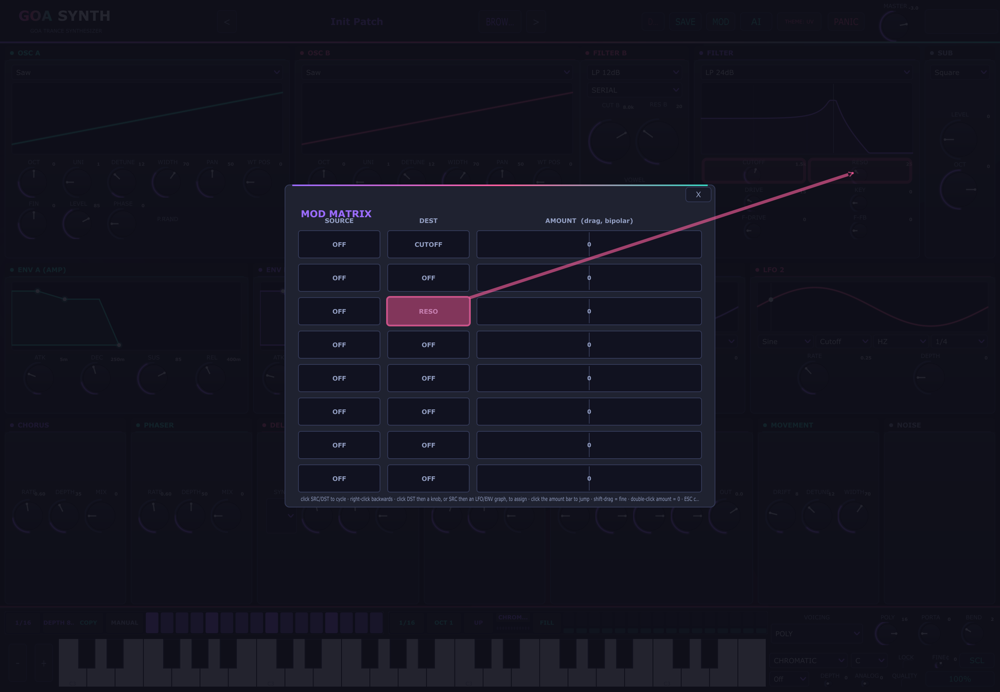

# GoaSynth — Goa Trance VST3 Synthesizer


A polyphonic virtual-analog synthesizer plugin (VST3) designed for Goa trance
production: TB-303-style acid bass, supersaw leads, hoover stabs, FM bleeps,
PWM pads — with tempo-synced ping-pong delay, chorus, phaser and reverb built in.

## Scale quantizer & microtuning
The arp sequencer (and, with **LOCK**, live playing) snaps into one of nine
scales — MINOR, PHRYGIAN, HARM MIN, HUNG MIN, DBL HARM, DORIAN, MAJOR,
PENTA MIN — against a selectable root (**ROOT** C..B; **SCALE** and **LOCK**
live next to the voicing controls). CHROMATIC = off.

**Microtuning:** **SCL** (bottom right) loads a Scala `.scl` file; the tuning
applies to every voice and persists across sessions (a copy is kept in
`%APPDATA%\GoaSynth\tuning.scl`). Click **SCL** again to return to 12-TET,
and **FINE** trims ±100 cents (432 Hz ≈ −32).

## Master quality (2x oversampling)
**QUALITY** (bottom right, default off) renders every voice's oscillator +
filter chain twice per output sample at half spacing and averages the two —
classic 2x oversampling. Waveform edges and resonant sweeps alias roughly an
octave less; CPU roughly doubles, which is why it's a switch, not a constant.
Filters, DC blockers, the drive/feedback path and the vowel bank each keep
independent per-parity state so the handoff between modes is click-free, and
cutoff smoothing runs in the log domain (rate-normalised), so the filter
character is identical at 44.1k and 96k. All 20 factory LEAD and 19 RISER
patches enable QUALITY (they benefit most from the cleaner highs); every
other category stays at the fast default path.

## Sidechain pump, analog character, filter drive & zoom
- **PUMP / DEPTH** (bottom right): host-synced sidechain-style volume dip —
  pick the beat division (1/4 … 1/16 T) and depth; the synth ducks on the
  beat and recovers exponentially, no DAW sidechain routing needed.
- **ANALOG**: tape-style wow (0.4 Hz) + flutter (5.3 Hz) plus a slow random
  per-voice drift for wobbly old-machine character.
- **F-DRIVE / F-FB** (FILTER panel): pre-filter saturation and a one-sample
  resonant feedback path — screeching Goa leads at high settings, with a
  hard safety clamp so it can never run away.
- **FILL** (arp strip): writes 3–6 in-scale steps into rests, leaving your
  programmed pattern untouched — instant psy rolls in the current SCALE/ROOT.
- **Zoom** (bottom right button, or **Ctrl + Plus / Minus**, or **Ctrl + scroll**):
  100–200% interface scaling in 25% steps, remembered in `%APPDATA%\GoaSynth\zoom.txt`.

## Vowel / formant filter
The FILTER B panel hosts a morphing formant bank (AH → EH → EE → OH → OO):
**VOWEL** enables it, **MORPH** walks the vowel sequence, **V-RES** sharpens
the formant peaks, **V-MIX** blends dry/filtered. LFO target **VOWEL** moves
the morph for talking-lead and forest-style textures; AI patches can use all
of it (`vowelOn`, `vowelMorph`, `arpScale`, `tuningFine`...).

Built with JUCE 8 (fetched automatically by CMake). The interface follows a
Serum-style dark workflow with six switchable skins (the **THEME** button):
**UV GOA** (violet / teal / magenta over purple-black — the house look),
**STEEL** (studio blue-greys with a restrained cyan-steel primary and amber
secondary), **WARM** (analog rack: cream face, orange/olive/rust accents),
**NEON** (cyberpunk cyan / hot magenta / neon yellow on deep black),
**PAPER** (warm off-white with cobalt, emerald and amber accents — a light
mode for daytime sessions) and **OLED** (pure black with a single red accent
for maximum contrast and battery life). The choice is stored with the session
and restored on reopen. Behind the panels an **animated psychedelic swirl**
counter-rotates at ~30 fps — two pre-rendered log-spiral layers in the UV
palette — and scale-pulses subtly with the smoothed output level, so the room
breathes with the music. The surface is three panel rows — oscillators, filters
and sub; envelopes and LFOs; then the FX row — over the gate, arp and keyboard
strips, with waveform and filter response displays, draggable ADSR envelopes,
animated LFO scopes, a preset browser with previous/next arrows, and a built-in
octave-shifted keyboard.

The **AI patch designer** re-rolls every time: the same prompt always yields a
different but musically-related patch (waveform flavours, octave placement,
unison/detune rolls, filter offset, pan spread, delay division, fresh
gate/arp grooves and humanised envelope jitter), with a variant suffix (II,
NEO, PRIME...) in the title so generations are easy to tell apart in the
browser. Save the ones you like.

The overlay's **AI ENGINE** button switches between the offline designer and
real LLM-backed generation:

- **LOCAL** (default) — the built-in offline designer, no key or network.
- **GEMINI** — Google Gemini (`gemini-3.6-flash` default): paste an API key from
  aistudio.google.com into the key box.
- **OPENAI** — OpenAI chat completions (`gpt-5.6-luna` default: the cheap, fast
  tier; CUSTOM covers other OpenAI-compatible providers).
- **CUSTOM** — base URL of an OpenAI-compatible server (Ollama
  `http://localhost:11434/v1`, LM Studio, OpenRouter...). No key needed for
  local servers; leave the box as your URL.

The **MODEL** button next to the key box cycles the newest models per engine
(Gemini: 3.6 Flash → 3.5 Flash → 3.5 Flash-Lite; OpenAI: 5.6 Luna → 5 Mini →
4o Mini legacy; Custom: the server's default). The choice is remembered in
`ai.txt`, and hand-typed model ids are honoured too — paste one into the file's
third line if a provider ships something newer than this build knows.

**TEST KEY** (next to MODEL) sends a tiny live request so you can confirm the
key and model actually work before spending a full generation. It reports
`OK • <model> accepted the key and answered` on success, or the provider's own
error (401 key rejected, 429 rate limit, unreachable host...) on failure.

Keys are stored per-user in `%APPDATA%\GoaSynth\ai.txt` via **SAVE KEY** and
sent only to the provider you chose. Cloud replies run through the same
hardened sanitizer as the offline designer — unknown ids, out-of-range values
and bogus choice names are dropped or clamped before anything touches the
synth. When a reply fails validation, the plugin automatically sends ONE
correction follow-up — the model sees its own rejected JSON plus exactly what
was dropped or clamped — and the retry usually comes back clean; only a second
failure surfaces an error. The offline designer remains the automatic fallback
when the network or the provider fails.

**LOCAL keeps learning.** Every successful cloud patch is archived with its
brief in `%APPDATA%\GoaSynth\Learned`. Offline generations blend in the
best-matching archived entries (brief/title word match), so the offline
designer gradually inherits the character of the cloud models you actually
used — even months later with no network and no key. The bank is capped at the
150 most recent patches and stores no credentials or raw replies.

A **VARIATION** selector in the overlay scales how far re-rolls stray:
**SUBTLE** keeps the family's core choices and lays classic grooves (3-on/1-off
gate, 1/16 minor roller) with half-strength jitter; **NORMAL** is the default
free re-roll; **WILD** doubles the jitter, widens the filter/FX ranges and may
redesign waves, octaves and groove density wholesale.

## Sound engine

- **2 oscillators (A/B)** per voice: Saw / Square / PWM / Triangle / Sine, or a
  **drawable 8-frame wavetable** per oscillator, each with octave (+/-2), fine
  detune (+/-50 cents), level, **pan**, **start phase**
  (+ phase randomization); oscillator B can phase-modulate oscillator A (FM).
  **PULSE W** sets the PWM duty cycle directly (both oscillators share it, so a
  two-oscillator PWM patch stays width-coherent) and is a mod destination, so an
  LFO can sweep the width without spending the LFO's own PWM target row.
  Two inter-oscillator modes sit alongside FM: **SYNC** (hard sync — OSC A's
  phase is reset by every OSC B cycle, the classic metallic sweep) and **RING**
  (blends the product of the two oscillators into OSC A, 0 = off, 1 = pure ring).
- **Wavetable morphing**: a WT POS knob sweeps through the drawn frames with
  linear frame interpolation; both LFOs offer "WT POS A/B" targets for evolving
  spectral movement. Frame editing: pick a frame in the strip under each
  display, sketch it (left-drag draw, right-drag erase, double-click reset);
  the other frames show as ghost outlines and the display shows the live
  morphed output. Tables are band-limited per frame (partial phases preserved,
  raised-cosine band fade) so hand-drawn shapes don't alias up the keyboard.
- **Wavetable edit tools**: each OSC display has a one-click tool row (SMOOTH
  blur, FLIP polarity, NORM re-level, and the P25 / P50 / FORMANT / SPIKES shape
  generators) that applies to the selected frame; transforms remove DC and
  normalize, so even scratchy doodles play at full level. The row ends with
  **WAV**: pick an audio file and it is sliced into the oscillator's eight
  frames, each resampled to 256 points and peak-normalised, and the oscillator
  switches to its User wave so the import is audible immediately. Dropping a
  `.wav` onto the OSC A or OSC B panel does the same thing (onto B for B,
  anywhere else for A).
- **Sub oscillator** (square / sine / triangle, 0-2 octaves below the note) and **white noise**.
- **Unison** up to 7 detuned voices around both oscillators with stereo spread —
  classic supersaw/trance lead. UNI / DETUNE / WIDTH in the OSC panels and
  DRIFT / DETUNE / WIDTH in the MOVEMENT panel edit the same global stack, and
  the SUB panel's **CHAR** cell reshapes the detune/pan field itself (CLASSIC
  linear spread, PHASED centre bunching, HYPER widened outer voices).
- **Chord memory**: the SUB panel's **CHORD** cell makes every key also
  sound scale-snapped intervals (5TH / MINOR / MAJOR / OCT) in POLY voicing.
  Notes are reference counted, so a key that is both held and sounded as
  another key's chord tone only stops when the last claim on it is released.
- **Sound quality**: saw/square/PWM are polyBLEP band-limited, the sub square
  too; wavetables are mip-mapped with raised-cosine band fades so nothing
  aliases up the keyboard. Cutoff smoothing is log-domain (identical glide
  character at 44.1k or 192k), a DC blocker after the drive stage keeps heavy
  saturation from thumping the limiter, and the tempo delay feeds back through
  a 5 kHz lowpass for analog-style darkening repeats.
- **Analog drift** — slow random pitch wander per voice.
- **Filter**: 12dB/24dB lowpass, highpass, bandpass, **notch** (TPT state-variable),
  resonance, drive, key tracking, filter envelope (+/- 5 octaves).
- **Filter B + routing**: a second independent filter (same type list, its own
  cutoff/reso) with a **ROUTE** selector — **SERIAL** (B follows A; the 24 dB
  LP keeps the classic cascade), **PARALLEL** (A and B summed 50/50 — e.g. LP+HP
  = band limiter), and **SPLIT** (A filtered to the left channel, B to the
  right, for wide stereo filter movement).
- **Mod matrix** (MOD button): 8 freely routable slots with **A/B routing banks** (edit bank B
  from the card header, flip the live bank with the BANK B switch in the bottom bar), a per-slot
  **curve** (LIN/EXP/SIN) and **lag** (slew) cell. Sources: LFO 1/2,
  filter env, amp env, velocity, modwheel, **S&H** (block-rate random), **aftertouch**, and
  **MACRO A/B** (also MIDI CC 14 / CC 15 out of the box). Destinations: cutoff (±4 oct),
  **FILTER B cutoff and resonance**, osc fine tune (±1200 ct), osc levels,
  wavetable positions, reso, drive, **pulse width**, **vowel morph**,
  **analog character**, osc pan, LFO rates, and the shared FX (delay time ±2 oct, feedback, mix,
  phaser mix, reverb size/mix, **OTT depth**, **sidechain pump depth** — the deepest voice wins). Click a cell to cycle values (right-click goes backwards), click the
  amount bar to jump the amount straight to that point, drag it vertically
  (shift-drag for fine changes), double-click amount/src/dst to reset it
  (0 / OFF); negative amounts reverse the response. Faster assigning: click a
  row's DST cell and then click any knob in the synth UI to route it (same DST
  again or ESC cancels; non-routable knobs are refused), or a SRC cell and an
  LFO scope, ENV graph or MACRO knob.
- **2 ADSR envelopes** (amp + filter), velocity-sensitive, with draggable graphs.
- **2 LFOs** (sine/triangle/square/random S&H) routable to Pitch, Cutoff,
  PWM width or Volume, with animated displays; free HZ or **host-tempo BPM sync**
  (1/1 ... 1/16, 3/16).
- **Voicing**: POLY (1-16 voice limit with stealing) / MONO (retriggering) /
  LEGATO (slide) — full 303 behaviour with glide and pitch bend, mod wheel ->
  cutoff, sustain pedal support.
- **FX chain**: chorus -> phaser -> **OTT multiband compressor** ->
  tempo-synced ping-pong delay (Off / 1/16 / 1/8D / 1/8 / 1/4 or free ms) ->
  reverb -> master gain -> **master 3-band EQ** -> limiter. The OTT splits the signal at 220 Hz / 2 kHz
  (4th-order crossovers) and applies the classic fast upward+downward squeeze to
  each band — DEPTH blends from transparent to full psy squeeze, per-band LOW /
  MID / HIGH trim the response, OUT is an output pad. Depth 0 is a true DSP
  bypass. The reverb grows a **SHIM** (octave-up pitch-shifted tail) and the
  delay + reverb duck under the dry signal with **DUCK**, so leads stay clear
  while the tails swell in the gaps. The **master EQ** (bottom-right, next to the
  pump/analog row) is a low shelf at 200 Hz, a peaking mid with its own frequency
  and a high shelf at 4 kHz, all ±15 dB — it sits after MASTER and before the
  limiter, and an all-0 dB setting is a true bypass (no filtering at all).
- **Trancegate**: 16-step volume pattern with 1/32 ... 1/4 step lengths (incl.
  dotted/triplet), sample-accurate and phase-locked to the host transport bar —
  start playback mid-pattern and the gate is already on the right step. Click or
  drag on the strip to toggle steps; right-click cycles the division, the second
  cell sets chop depth. A **PATTERN cell** launches classic trancegate shapes —
  UPLIFT (3-on/1-off), OFF-BEAT house, ROLLER 8ths, SLOWROCK half-time, 16THS,
  OFF+4TH swell — cycling with left/right click; hand edits flip it back to
  MANUAL. The **SHAPE cell** sets the edge contour for every step: SQUARE (the
  hard gate), SMOOTH (half-cosine rise/fall), SAW (instant-on, falling ramp) and
  TRIANGLE (sine swell) — the whole pattern hard-chops or swoons together. All
  steps on = bypass. The **COPY cell** mirrors the arp strip's
  active/rest pattern onto the gate in one click, so a programmed arp run gets
  an identically gated trance chop.
- **Arp sequencer**: a second 16-step strip plays the held note as a programmed
  semitone run (each step: Rest or +0...+11), with 0-3 octave range and the same
  sync divisions — classic Goa rolling arp lines. Each step has a **velocity
  bar** (drag it up/down; right-click toggles a full-velocity accent) that the
  synth plays back exactly, for pumping off-beat dynamics, plus a **gate band**
  (drag left/right) that sets the step's note length from 5% to 100% of the
  step. The playhead cell lights up while the transport runs. The **DIR cell**
  cycles playback direction: UP, DOWN, UP-DOWN (ping-pong), RANDOM (fresh roll
  every step), CONVERGE (outer pair inward, 0-15-1-14-...) and STRUM (every held
  note fires at each boundary, staggered ~18 ms bottom-up — a strummed chord,
  with the step's semitone transposing the whole chord). The arp also **emits the notes it
  plays to the host's MIDI output**, so a generated line can be recorded to a
  track or fed to another instrument; only the arp's own events are sent (the
  incoming notes are never echoed back).

## Patch workflow

Five buttons sit in the bottom bar beside the octave keys:

- **RAND** — randomises the patch. The draw is musically biased rather than
  uniform (envelope times favour the short end, wet amounts stay moderate, drive
  and resonance stay clear of the extremes, cutoff stays mid-forward) because a
  uniform value in every cell produces 5-second attacks and full-wet reverb.
  Structural parameters are left alone: the mod matrix, the gate/arp step
  patterns, master gain, fine tune, voicing, polyphony, bend range, quality and
  the phase-randomisation switches. Booleans get a coin flip.
- **UNDO / REDO** — a 32-step stack of whole-patch snapshots. Pushed by preset
  loads, randomise, A/B swaps and knob/selector gestures (one snapshot per
  gesture, taken at drag start). It deliberately does not try to undo host
  automation ramps: those are the host's business, and pushing on every
  parameter change would fill the stack within seconds.
- **A / B** — two slots holding two versions of the patch. The first press puts
  both slots on the current sound and moves you to B (nothing changes audibly);
  edit, then press again to flip. The button label shows the live slot.
- **LOCK** — lock mode. Click any knob to protect it: locked knobs are skipped
  by RAND and by preset loads, and show a small filled mark in their top-left
  corner. A click in lock mode toggles the lock instead of moving the value, so
  the knob does not jump. Press LOCK again to leave lock mode.

The header carries a **stereo output meter** next to the MASTER knob: true
per-channel peaks (green to about -6 dBFS, amber to -1, red above) with
DAW-style **peak-hold ticks** that freeze for about a second and then fall,
so transient levels are readable against fast programme material.

The **noise** oscillator offers **white or pink** generation (pink is the
natural -3 dB/oct tilt of cymbals, air and wind) with a decorrelated stereo
image, the **trancegate** renders every step edge click-free — a ~1 ms slew on
the hard SQUARE shape, half-cosine, falling-ramp and sine contours on SMOOTH,
SAW and TRIANGLE — while staying sample-accurate on the grid, and the **arp
sequencer** accents any step whose velocity is pulled to 100% (louder + a
longer gate, TB-303 style).

## Host integration

- **Program list**: the host's own patch menu lists the whole factory bank —
  program 0 is *Init Patch* (all defaults) and programs 1..175 are the factory
  patches in bank order, so a DAW can browse and automate the bank without
  opening the plugin's browser. Loading a program and clicking a preset in the
  browser produce the same sound (both reset to defaults, then apply the patch).
  Program names are read-only (the bank is compiled in).
- **MIDI output**: the plugin declares a MIDI output and emits the arp's
  generated notes on it.
- **Formats**: VST3 on Windows, macOS and Linux, plus **AU / AUv3** on macOS
  (Logic) and **LV2** on Linux. CLAP is not available in the JUCE 8.0.8 release
  this project pins, so it is not built; adding it would need a newer JUCE or a
  third-party wrapper.

## UI polish and micro-interactions

- **Knob hover glow**: a soft radial halo appears under each rotary when the
  pointer is over it.
- **Panel lift**: hovering a module panel brightens its top edge, adding depth
  without breaking the flat aesthetic.
- **Filter response glow**: the FILTER graph draws the magnitude curve with a
  soft glow stroke behind the clean line.
- **Active step glow**: the gate/arp playhead step gets a bright halo + crown
  highlight so you can follow the rhythm at a glance.
- **Breathing logo**: the GOA header logo slowly pulses its glow at ~4 s period.
- **Grain texture**: a subtle film-grain dot pattern is painted over the
  background gradient, adding organic texture to the vector surface.
- **Rounded corners**: panel corner radius increased from 3 px to 6 px for a
  softer, more modern feel.

## Factory presets

175 patches in 9 categories — 20 each of ACID (303-family squelch), BASS
(rollers, subs, growls), LEAD (supersaws, hoovers, screeches) and PAD (swirls,
drones, choirs), and 19 each of FM (bells, metallics, vocal forms), FX (sweeps,
noise, zaps), PLUCK (trance fingers, kotos, glass), RISER (builds, sweeps,
noise jets) and SYNTH (organs, EPs, strings, clavs). Each preset carries its
category as a tag, so the browser's TAG filter doubles as a category menu — pick
"ACID" or "PAD" to see just that family. Names are prefixed by category
(ACID .../ BASS ...), which also makes search work as a category filter.

## Preset browser

The header shows the current patch name plus **< / >** arrows, and **BROWSE**
opens a Serum-style overlay: folder tabs (**ALL / FACTORY / USER** plus a
**favourites** star tab), a live **search box** that matches names *and* tags,
a **TAG filter** built from every tag in the bank, a **SORT** menu
(A-Z / Z-A / NEWEST / BANK ORDER) and a live "shown of total" count. The list
is grouped (FACTORY / USER PATCHES), zebra-striped, stars favourites, shows up
to three tags per entry and a teal **SHARED** badge on machine-wide patches.
Click a row to **audition** it with the browser still open; double-click or
Return loads and closes; ESC closes without rolling back the patch you already
auditioned. Click a tag to filter by it, right-click a row for
load / rename / duplicate / delete / reveal. DEL removes the selected user
preset; factory patches are never touched.

## User presets

SAVE stores the complete current patch — every parameter plus both drawn user
waves — as a `.goapreset` file in `%APPDATA%/GoaSynth/Presets`. The save dialog
takes space-separated **tags** (e.g. "acid bass night") and a **SHARED**
toggle: shared patches land in `C:\Users\Public\Documents\GoaSynth` and are
visible to every Windows account on the machine (a same-named preset in your
own bank shadows the shared copy). Saved patches appear under the USER PATCHES
section, load into any session, and AI-generated patches are just a SAVE click
away from becoming permanent. In the browser, presets from the shared bank
wear a teal **SHARED** badge so you can always tell which bank a patch lives
in (and whether DEL will touch other users' sounds).

## Preset packs

The preset browser has **EXPORT PACK** and **IMPORT PACK** buttons for moving
whole banks in and out of the plugin. A pack is a `.goapack` file — a plain ZIP
containing `.goapreset` files — so it's easy to email, torrent or archive.

- **EXPORT** writes every patch in the merged bank (your own presets, plus
  shared-bank patches and their tags) into a single pack. A native overwrite
  prompt protects existing files.
- **IMPORT** merges a pack into your user bank: existing presets are skipped
  (the pack can't silently clobber what you have), new ones land in the browser
  immediately, and junk entries (READMEs, `__MACOSX` folders) are ignored.
  Path-flattening on import means hostile or nested zip entries can never
  write outside the presets folder.
- Packs round-trip: export → send to another machine/account → import → play.

## Website

The landing/documentation site lives in [`docs/`](docs/) as plain static files — no build step,
no dependencies, no external requests. Open `docs/index.html` directly, or point any static host
(GitHub Pages, Netlify, Cloudflare Pages) at the `docs` folder. `docs/.nojekyll` is already there
for GitHub Pages.

It covers the whole plugin — engine, wavetable drawing, filters and routing (including F-DRIVE /
F-FB and the vowel bank), envelopes/LFOs, the mod matrix, the FX chain and OTT, trancegate and arp
(with the scale quantiser and the FILL helper), the tuning section (nine scales, LOCK, Scala `.scl`
microtuning), pump / analog character / QUALITY, the AI patch designer (the offline LOCAL engine, the
optional cloud engines, the correction round and the learned memory), preset browser/packs, the three
skins, full specifications, per-OS install steps, the activation and 24-hour trial flow (machine ID →
serial → `.goalicense`), the pricing and licence position, and an FAQ — plus an interactive **Play**
section (the trancegate demo, synthesised in the browser with the Web Audio API, no samples) — and
embeds five screenshots in `docs/assets/`.

The plugin is sold: one personal licence for **€15**, one-time, with the source staying public under
the AGPLv3. The site therefore has a **Pricing** section and Buy buttons everywhere, and every price
in the copy is stamped from `CONFIG.price`, so that is a one-line edit — but the legal pages carry the
figure as plain text (Terms §3 and the EULA), so change those too. `DocsCheck` (below) fails when they
disagree.

Configure the links in the `CONFIG` block at the top of `docs/app.js`:

| Key | What it is |
| --- | --- |
| `price` | Displayed price, e.g. `'€15'` — written into every `<span data-price>` |
| `store` | Store name, used in the "handled by …" sentence, e.g. `'Lemon Squeezy'` |
| `vatIncluded` | `true` for tax-inclusive store pricing, `false` to advertise "VAT added at checkout" |
| `checkout` | Hosted checkout URL from your merchant of record |
| `ordersEmail` | Fallback while the store is offline: Buy buttons become a pre-filled order email |
| `support` | Support address; falls back to `ordersEmail` |
| `download` | Customer download page, sent in the purchase receipt |
| `repo` | Public source repository; the Source/Repository links hide themselves while it is empty (instead of falling back to the current page) |
| `machineIdField` | `true` when checkout collects the buyer's machine ID (the serial is signed against it); set `false` to hide the note on the pricing card |

The page runs in exactly one of three modes — live store, order-by-email, or neither — and only ever
promises the one that is configured, so it can never advertise a checkout that doesn't exist. Leaving
`repo` empty on GitHub Pages still derives `github.com/<user>/<repo>` from the Pages URL. Clicking the
three skin cards repaints the whole site (UV GOA / STEEL / WARM), the same skins the plugin ships
with.

Because the plugin is activated with a machine-bound serial, the site's checkout copy, install steps,
spec table and FAQ all describe that flow: install the trial build, copy the machine ID from the
activation screen, give it at checkout, then double-click the `.goalicense` file that comes back. The
order-by-email fallback pre-fills that request. `Fulfil/CHECKOUT.md` (§3 and §3b) has the fulfilment
workflow, including the keypair backup that has no recovery if you skip it.

Setting up the store itself — merchant of record, tax handling, the product fields, the delivery ZIP
and the pre-launch test pass — is documented in [`Fulfil/CHECKOUT.md`](Fulfil/CHECKOUT.md). That file
sits outside `docs/` on purpose: **everything under `docs/` is served by GitHub Pages**, and the
playbook is seller-side notes (fees, key handling, the refund procedure), not a page for visitors.

### Being found: robots, sitemap and one canonical address

The site ships the files a search engine looks for, so a page becomes crawlable without anyone
remembering to submit it:

- `docs/robots.txt` allows the whole tree and names the sitemap — there is no private area, no admin
  route and nothing to exclude.
- `docs/sitemap.xml` lists **every** published page.
- Every page declares a `<link rel="canonical">` (the landing page and the four legal pages), and the
  landing page carries Open Graph / Twitter cards plus a `SoftwareApplication` JSON-LD block, so a
  link preview and a rich result read the price, the platforms and the preset count from data rather
  than guessing them from prose.

Neither file is written by hand. The pages say where they live — each page's canonical link — and
the tool reads that and writes the other two:

```bash
python tools/make-site-index.py           # rewrite robots.txt and sitemap.xml
python tools/make-site-index.py --check   # report whether they have drifted (exit 1 if so)
```

It reads every `.html` file under `docs/`, refuses a page with no canonical link (or with two, or with
a relative one), refuses two pages claiming different origins, and writes the sitemap from the
canonicals that remain — so a new page is picked up by *being* a page, and there is no second list to
keep in step. Search-engine verification files (`google*.html`) are recognised as tokens and skipped.
The output is deterministic, so re-running it over an unchanged tree is a no-op.

`DocsCheck` checks the same three files at test time, which is the backstop: it compares every page's
canonical address against the sitemap and `robots.txt`, fails when a published page is missing from
the sitemap, and fails when the sitemap lists a URL that nothing serves. So a forgotten page fails the
build, and this tool is the one-command fix.

Everything still names `https://y4m4.github.io/GoaSynth/` — the GitHub Pages address of this
repository. Moving to a custom domain is therefore: change the canonical link in `docs/index.html` and
the four legal pages (that is the whole source of truth), change the absolute `og:image` /
`twitter:image` URLs in the landing page's head, then run the tool. Nothing else knows the host.

One file under `docs/` is deliberately *not* a page: `docs/googlebe8101dec58dcb76.html` is Google
Search Console's proof that the site is ours. It has to be served from the site root, carries no
canonical and belongs in no sitemap, so `DocsCheck` recognises `google*.html` as a token and exempts
it from the rules above — and from nothing else, so any other new page still needs a canonical link
and a sitemap entry. If the property is ever re-created, replace that file with the new token (and
update the name on `PublishCheck`'s allowlist, which every served file must be on).

Once deployed, submit the site once in [Google Search Console](https://search.google.com/search-console)
and Bing Webmaster Tools — the Google token above is already live, so verification is a click. A
sitemap can only be discovered from `robots.txt` after a crawler has been to the site at least once,
and the first crawl of a new site can take days — so submit it rather than waiting. There is also nothing to hide: if a `/private/` or `/orders/` folder is ever served from
`docs/`, add a `Disallow` to `robots.txt` *and* a note there saying why, because access control is not
what a robots file does.

### Before you publish: the preflight check

Because `docs/` *is* the website, a file dropped in there is public the moment you deploy — which is
how a stray order export, a fulfilment manifest or a pasted keypair ends up on the internet. Run this
before you push, or let it run with the suite:

```bash
./build/Release/PublishCheck           # or: ctest -R PublishCheck
```

It fails on three things: a file in `docs/` that is not on its **allowlist** (the allowlist is the
list of things meant to be public, so a new page has to be added deliberately); seller-side or secret
material inside an allowed page (keypair and ledger filenames, the generated key header, a real signed
serial, API-key shapes, an auth token, someone's own `C:\Users\<name>` profile path — while the
plugin's documented `C:\Users\Public\...` bank is fine); and a served page linking to something
outside `docs/`, which would 404 or point at the rest of the repository. Failures print the file and
line number. `PublishCheckTest` proves each of those cases is actually caught, and that a fresh copy of
the real site passes.

### Before you publish: the drift guard

`PublishCheck` guards leaks. Nothing guarded *accuracy* — and the site has already gone false once:
the activation gate and the optional cloud AI engines both landed in `Source/` after the pages were
written, leaving about twenty statements on the site (two of them in a published privacy policy)
describing behaviour the plugin no longer had. So a second checker reads the plugin's own source for
the facts the pages restate, and fails when they disagree:

```bash
./build/Release/DocsCheck            # or: ctest -R DocsCheck
```

It compares five things: the **price** (`CONFIG.price` in `docs/app.js` against every euro amount on
every page, legal pages included); the **preset bank** (the `// FAMILY (n)` headers in
`Source/Presets.h` against the preset grid, plus the `N patches` headline, and every
preset the page cites by name — the site's "Patch of the week" card marks its
patches with `data-preset="NAME"`, which is checked against the real bank; the
counts alone once let a card advertise `PSYTRANCE BASS 4` and `UPLIFTING LEAD 2`,
neither of which ships); the **AI defaults** (the
first model in each cloud table in `Source/AiCloudGen.cpp`, so a retired default like the 2.0 Flash
era cannot linger on the page); **local storage** (every path the plugin creates via `getChildFile()`
against the privacy policy, which is what makes the policy self-maintaining); and the **trial length**
(`License.h`'s `trialHours`). `DocsCheckTest` injects each kind of drift into a scratch copy of the
tree and asserts the guard catches it — a checker whose failure mode is a silent pass needs that
proof.

The policy documents stores ask for at signup live in [`docs/legal/`](docs/legal/): the
[Licence Agreement](docs/legal/eula.html), [Terms of Sale](docs/legal/terms.html),
[Refund Policy](docs/legal/refunds.html) and [Privacy Policy](docs/legal/privacy.html). They are
drafts: every value you must supply is marked with a highlighted `class="ph"` placeholder, and each
file opens with a comment describing what to replace.

## Building

Requires CMake 3.22+ and MSVC 2022 (Windows), Xcode (macOS) or a g++/clang
toolchain (Linux).

### Brand assets

The logo and app icon live in `Assets/` and `docs/favicon.ico`, all generated by
one deterministic script (no font files, pure Pillow):

```bash
python tools/make-brand.py
```

It draws the site's sine-swoosh mark in the plugin's house palette
(violet/teal/magenta over purple-black) and writes the tile icons the build
embeds (`ICON_BIG`/`ICON_SMALL` in CMakeLists.txt — juceaide turns them into the
Windows `.ico`, the macOS `.icns` and the VST3 bundle's `Plugin.ico` for the
plugin, standalone, installer and licence helper), plus the website favicon and
a vector SVG mark/lockup. Output is byte-stable for a given script, so
re-running it never churns the repository.

```bash
cmake -B build -G "Visual Studio 17 2022" -A x64 -DCMAKE_POLICY_VERSION_MINIMUM=3.5
cmake --build build --config Release --target GoaSynth_VST3 --parallel
```

The plugin is produced at:

```
build/GoaSynth_artefacts/Release/VST3/GoaSynth.vst3
```

Run the tests with `ctest --test-dir build -C Release`: `RoundTripTest` (preset
and state round-trip, the licensing paths, cloud-reply sanitising, scale
quantiser, Scala microtuning, vowel filter, pump and filter drive, and
note-off symmetry — that Scale Lock and chord memory never strand or silence a
voice),
`OverlayTest` (builds the real editor offscreen: every overlay must open on
screen with laid-out children, the MOD pick/flash/dot workflow, and a unit-map
sweep over every knob's value formatting),
`FulfilTest` (the fulfilment tool, against a sandbox keypair), `PublishCheck` /
`PublishCheckTest` (nothing seller-side or secret is about to be published with
the website — see [Before you publish](#before-you-publish-the-preflight-check)),
and `DocsCheck` / `DocsCheckTest` (the site's claims still match the plugin —
see [the drift guard](#before-you-publish-the-drift-guard)).

`RoundTripTest` prints a `[phase] ...` line before each block and runs unbuffered, so if it ever dies
mid-run the log names the block it was in rather than being empty.

## Installing

Copy the whole `GoaSynth.vst3` folder (bundle) to:

- **Windows**: `C:\Program Files\Common Files\VST3\` (or your DAW's VST3 folder)
- **macOS**: `/Library/Audio/Plug-Ins/VST3/`
- **Linux**: `~/.vst3/`

Then rescan plugins in your DAW, create an instrument track, and play.

## Licensing (serial keys)

The plugin ships with a **24-hour trial**: the first launch stamps a per-machine
trial file (in the shared public folder, so a second Windows account can't
reset it) and everything works for 24 hours — full sound engine, FX, AI
designer, presets. A `TRIAL 23 h 59 m` badge in the header counts down and
clicks through to the activation screen. After expiry instances render silence
until activated; a serial (or the master key) supersedes the trial entirely.

Each serial is an **RSA-signed machine fingerprint**, so one serial =
one machine — keys shared between people simply fail to activate. There is no
online check; everything works offline.

### For buyers

On first open the plugin shows an activation screen with a **MACHINE ID**
(20 hex chars). Send it to the seller, receive a serial back, paste it in —
the plugin unlocks and stays unlocked. Re-installing Windows or changing
hardware changes the machine id and needs a fresh serial.

### For the seller

`GoaSynthKeygen` is a separate console app (built alongside the plugin, never
shipped to buyers). **Double-clicking it opens an interactive menu** — issue
files, list/verify/unregister serials, all numbered options; commands below are
the equivalent one-liners:

```bash
GoaSynthKeygen --init <master-key>   # ONCE: creates the RSA keypair + master digest
GoaSynthKeygen --rotate-master [newKey]
                                     # change ONLY the master key: the RSA keypair
                                     # is kept, so every serial already issued
                                     # stays valid. No argument = generate a
                                     # random 12-character key
GoaSynthKeygen --machine-id          # your own machine id
GoaSynthKeygen --gen <machineId> "John's studio PC"   # issue one serial
GoaSynthKeygen --genfile            # issue a .goalicense file, asked step
                                     # by step (no arguments to remember)
GoaSynthKeygen --file <machineId> "John's studio PC"  # issue one serial AND
                                     # export <GoaSynth-<id>>.goalicense
GoaSynthKeygen --list                # active serials (and how many are revoked)
GoaSynthKeygen --verify <serial>     # check a signature; flags a revoked one
GoaSynthKeygen --revoke <serial> [reason]
                                     # refund: pull a serial from the active
                                     # ledger and record why in
                                     # revoked_serials.txt (unlike
                                     # --unregister, which erases the line)
GoaSynthKeygen --master-info         # show the embedded master digest
```

> **Keep the master key out of the repository.** It is a universal unlock for
> every shipped copy of the plugin, so it belongs in a password manager — never
> in a commit, an issue, a build log, or a screenshot. `Source/LicenseKeys.h`
> (the public key + master digest) is gitignored for the same reason, and the
> test suite activates with a throwaway key in `tests/TestMasterKey.h` so it
> never needs the real one.
>
> If it does get out, `GoaSynthKeygen --rotate-master` retires it without
> touching the keypair, so no serial has to be re-issued: it rewrites the
> stretched digest in `keys.txt` and in `Source/LicenseKeys.h`, and records the
> change in `master_rotations.txt` (digests only, never the key). **Rebuild and
> republish afterwards** — a build that already shipped keeps accepting the old
> key, because the old digest is inside it, so rotation protects the next build
> rather than the copies already sold. The digest ships in every binary, so
> prefer the generated key over something memorable: an offline guess costs the
> attacker one attempt per 64 SHA-256 rounds.

### Fulfilling orders in bulk

`GoaSynthFulfil` (also built alongside the plugin, also never shipped to buyers)
turns the store's order export into signed licences: it scans a folder of
`*.csv`/`*.json` exports, finds each buyer's machine ID, signs through the same
`Keygen/KeygenCore.h` the keygen uses, and writes the `.goalicense` file plus a
reply-ready `.eml` with it attached.

```bash
cmake --build build --config Release --target GoaSynthFulfil --parallel

GoaSynthFulfil --inbox C:\goasynth\orders --out C:\goasynth\fulfilled \
               --from "GoaSynth <orders@yourdomain>" --repo https://github.com/you/goasynth
GoaSynthFulfil --inbox C:\goasynth\orders --watch --interval 60   # or leave it running
GoaSynthFulfil --inbox C:\goasynth\orders --dry-run               # report only, sign nothing
GoaSynthFulfil --status --out C:\goasynth\fulfilled               # everything issued so far
```

A `manifest.tsv` in the outbox makes each pass idempotent — a re-export, a crash
or a long `--watch` session cannot issue a second serial — and anything ambiguous
(no machine ID, or several plausible ones) lands in `needs-attention.tsv` rather
than being signed. Refunds are handled end to end: a refunded order is taken out
of the active ledger and recorded in `revoked_serials.txt` with the order number
as its reason, its manifest row flips to `revoked`, and `activity.log` keeps the
event. A buyer who buys again puts the same serial back in the active ledger (the
signature is deterministic) and the pass appends a `restored` event to
`revoked_serials.txt`, so `--list` and `--verify` stop calling a paying
customer's serial revoked. The refund that pulled it stays on the record -
the log is an append-only event stream, and a serial's state is its newest line.
`GoaSynthKeygen --verify <serial>` on such a serial says so: *was revoked on
<date> - refund - order 7001, later restored*.

Revocation is bookkeeping, not enforcement: an activated copy keeps working
because activation is offline. What it changes is which serials count as live
licences you support and re-issue — and it is what lets you answer "was order
7001 refunded?" months later, which `--unregister` (a transfer: erase the line)
cannot. `--revoke <serial> [reason]` is the same operation by hand.

Both seller tools take the keygen folder from `GOASYNTH_KEYGEN_DIR` when it is
set, which is how `FulfilTest` runs against a throwaway keypair instead of the
real one. `CHECKOUT.md` (in this folder) §3b has the workflow; `--help` lists
the flags and the email placeholders.

The keypair lives in `%APPDATA%\GoaSynth\Keygen\` (outside the repo). The
plugin embeds only the **public** key and a stretched SHA-256 of the master
key — the private key and master key never ship. `Source/LicenseKeys.h`
(gitignored) holds the generated constants; a fresh checkout builds with a
placeholder header that rejects all serials.

**Buyer-ready license files (`.goalicense`)**: `--file` wraps the issued serial
in a `GOA-LICENSE-1` text document. Send the buyer that one file instead of a
serial — they double-click it and GoaSynth activates on the spot, or they
press **IMPORT** on the activation screen and pick it. A file is
interchangeable with its plain serial: same signature, same machine binding,
same ledger — tampering with the informational lines cannot widen what it
activates, and a file bound to another machine is refused.

**Double-click helper** (`GoaSynthLicense.exe`, built alongside the plugin,
ships to buyers): a VST3 is a DLL, so Windows cannot open files "with" the
plugin — this small companion app owns the association instead. It registers
`.goalicense` for the current user under HKCU (no admin, no installer) on
first run, then double-clicks launch it and the file is activated through
exactly the same code path as the plugin's IMPORT button, with a small window
confirming the result (or showing the MACHINE ID to send you on failure).
`GoaSynthLicense.exe --unregister` removes the association again;
`--selftest` exercises register → verify → unregister for CI. If Windows
still asks how to open the file, picking "GoaSynth license file" once makes
the choice stick.

The trial file lives beside the machine ledger in the shared public folder
(`C:\Users\Public\Documents\GoaSynth\License\trial.txt`); `GOASYNTH_TRIAL_FILE`
redirects it for tests. It is a plain timestamp, so it is hardening against
honest users, not a determined cracker — the RSA-verified serial remains the
real gate.

The **master key** activates any machine when typed into the serial box —
keep it private (it is never stored in plain text anywhere; only its salted,
stretched digest is embedded, so the key cannot be extracted from binaries).
If it is ever exposed, `GoaSynthKeygen --rotate-master` retires it while keeping
every serial in the wild valid; only a leaked *keypair* would force a re-issue.
An activation ledger in the shared public folder (`C:\Users\Public\Documents\
GoaSynth\License\`) binds each serial to the first machine that activated it,
so a second Windows account cannot re-use the same serial. The machine
fingerprint mixes hostname, user, MAC addresses and the OS device id, so disk
images that only clone hostname + accounts still get their own identity.

**Transfers:** if a buyer re-installs Windows, changes hardware or sells the
license on, lift the old binding with
`GoaSynthKeygen --unregister <serial>` and issue a fresh serial for the new
MACHINE ID. Inside the plugin, the licence file is only refreshed through
`activate()`, and a deliberate deactivation also clears that machine's ledger
line — so a serial can never be permanently locked by an old binding.

## Notes

### UI conventions (for contributors)

How hover info and modulation indicators work in the editor — keep new
controls consistent with this. The published copy of this section (with the
screenshot inline) lives at
[docs/index.html → Contributing](docs/index.html#contrib):

**Tooltips.** Every interactive control has hover text, shown by the single
`juce::TooltipWindow` owned by the editor (without it, `setTooltip()` calls
are silent no-ops — this shipped broken once).

- Knobs and toggles (`goaui::Ctl` / `goaui::ToggleCtl`) build their tooltip
  automatically: **parameter name + live value in engine units**
  (`Cutoff (Hz) — 1500 Hz`, `Attack — 0.01 s`, `RESO — 25 %`, toggles show
  `— ON`/`OFF`). The unit map lives in `liveValueText()`
  (PluginEditor.cpp) — add a branch there for any new parameter unit. If a
  new knob shows a bare decimal or a wrong unit, the
  [unit-map sweep in OverlayTest](#building) fails and names the id.
- The text is rebuilt on every paint (~30 fps while the backdrop animates),
  so values track drags, host automation and preset loads while hovering —
  don't cache tooltip strings.
- Hand-written tooltips (buttons, graphs, strips, keyboard) follow the house
  style: *what it is*, then an em dash, then the gestures/behaviour
  (`OSC A wavetable editor — left-drag draws, right-drag erases …`).
- `Ctl`/`ToggleCtl` hold no tooltip themselves (plain `Component`): text is
  applied to the child widgets via their `setTip()` helpers.

**Mod dots.** A knob targeted by an active mod-matrix slot shows small dots
in its top-right corner — one per source slot (max 3), colour-coded: teal
LFO 1, magenta LFO 2, accent envelope, dim velocity/modwheel. The dot
**pulses with the live source value × amount** (an LFO dot breathes at its
LFO's rate); a slot only counts when its amount is non-zero, and depth over
±0.6 adds a ring. Hovering the knob lists the routings:
`MOD 2: LFO 1 -> CUTOFF (+40)`.


The snapshot is regenerated by the test suite — run
`GOASYNTH_KNOB_SHOT=1 ./build/Release/OverlayTest` (a routing to CUTOFF is
armed for the capture, then disarmed), and the test fails if the file comes
out blank.

- Scan + colours: `modDotSources()` / `paintModDot()` (PluginEditor.cpp).
- Dots refresh on matrix edits, overlay open and preset loads — if you add
  another path that changes slots, call `goaui::repaintCtlPaints()`.
- The live pulse reads `GoaSynth::uiLfo1 / uiLfo2 / uiEnvF / uiEnvA /
  uiVelocity` (relaxed atomics, last-voice-wins — indicator only).

**Pick-to-assign.** In the MOD matrix, click a DST cell then a knob (or a
SRC cell then an LFO/ENV graph) to route by pointing; ESC or re-click
cancels. The just-assigned cell flashes inside the card and a brief arrow
points from it at the clicked control, so the landed routing is confirmed
(the knob flash under the overlay's dim backdrop would
be invisible, so the card carries the confirmation). Source kinds are
identified by parameter ids on the widgets (`Ctl::paramId`,
`LfoGraph::rateParamId`, `EnvGraph::attackParamId()`) — set those ids when
adding new routable controls or sources.



Both illustrations regenerate with the suite:
`GOASYNTH_KNOB_SHOT=1 ./build/Release/OverlayTest` (a routing to CUTOFF is
armed for the capture, then disarmed), and the test fails if the file comes
out blank.

- JUCE is used under the AGPLv3 license; the VST3 interface code is used under
  Steinberg's GPLv3 dual license. Because the source stays public and builds are
  distributed under the AGPLv3, no paid JUCE or Steinberg license is needed in
  order to sell binaries — buyers receive the corresponding source along with
  the plugin. Choosing to ship closed source would change that and would need
  JUCE's proprietary option plus a Steinberg agreement.
